<div align="center">
  

  <h1>Full-Stack and Platform Developer</h1>

  <p>Building cross-platform tools, local-first applications, and reliable release workflows.</p>
  <p>Italy | Open to remote junior roles</p>

  <p>
    <a href="#tech-stack">Tech Stack</a> |
    <a href="#open-source">Open Source</a> |
    <a href="#selected-projects">Projects</a> |
    <a href="#github-stats">Stats</a>
  </p>
</div>

<p align="center">
  &nbsp;
  &nbsp;
  &nbsp;
  
</p>

---

## Tech Stack

<details>
<summary><strong>Languages</strong></summary>
<br />
<p>
  &nbsp;
  &nbsp;
  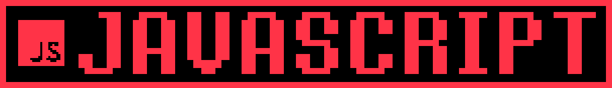&nbsp;
  &nbsp;
  &nbsp;
  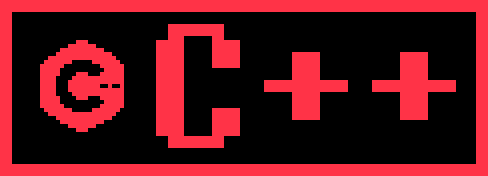&nbsp;
  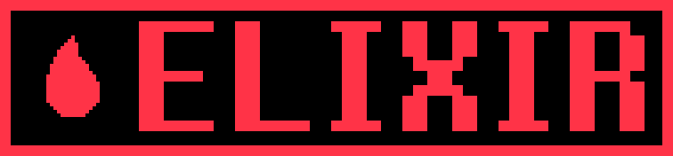&nbsp;
  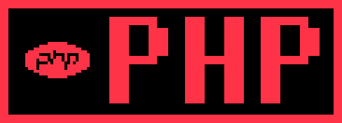&nbsp;
  &nbsp;
  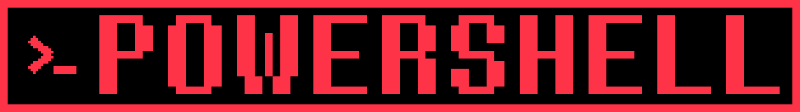&nbsp;
  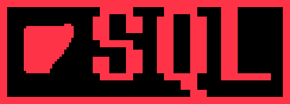&nbsp;
  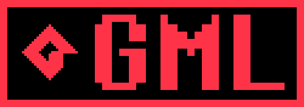&nbsp;
  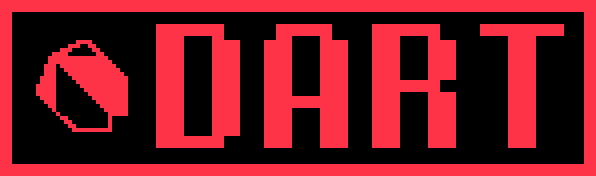
</p>
</details>

<details>
<summary><strong>Backend and Data</strong></summary>
<br />
<p>
  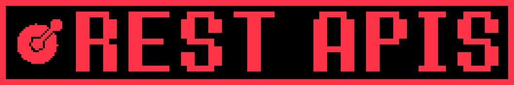&nbsp;
  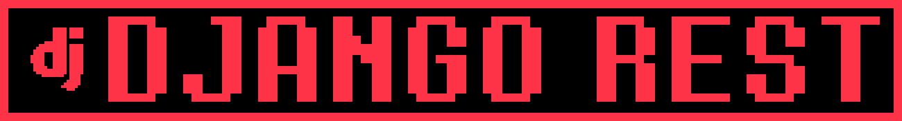&nbsp;
  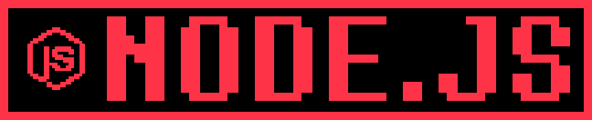&nbsp;
  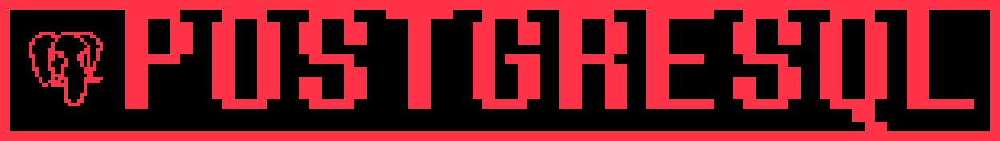&nbsp;
  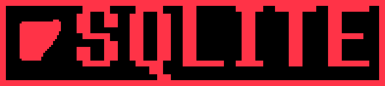&nbsp;
  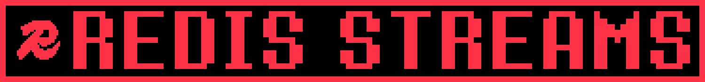
</p>
</details>

<details>
<summary><strong>Desktop and Web</strong></summary>
<br />
<p>
  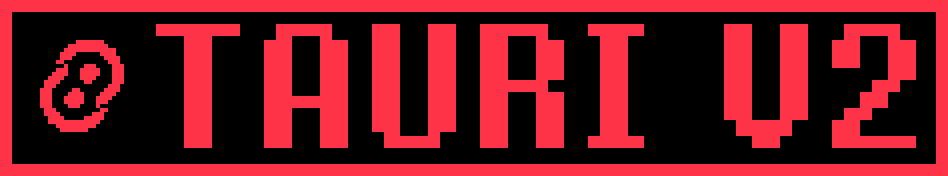&nbsp;
  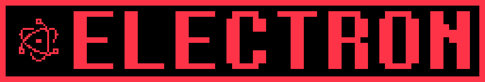&nbsp;
  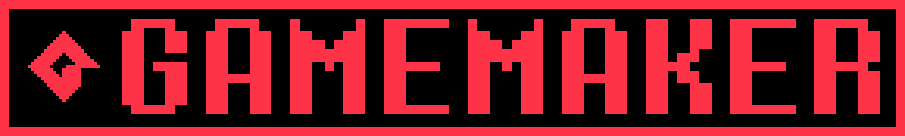&nbsp;
  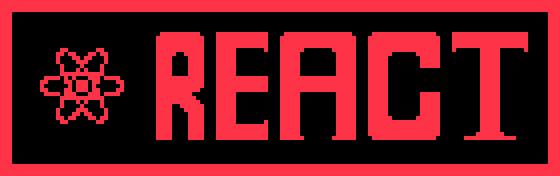&nbsp;
  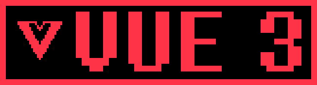&nbsp;
  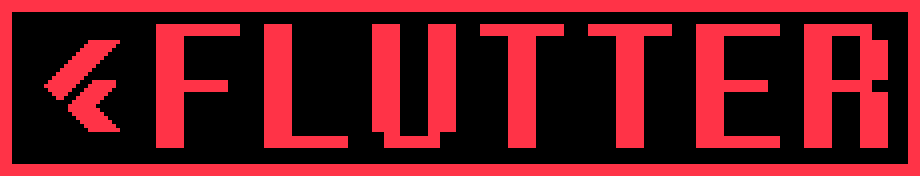&nbsp;
  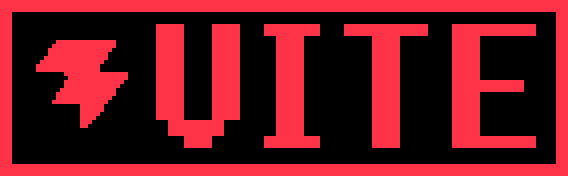
</p>
</details>

<details>
<summary><strong>Platform</strong></summary>
<br />
<p>
  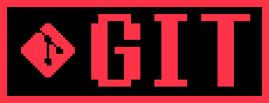&nbsp;
  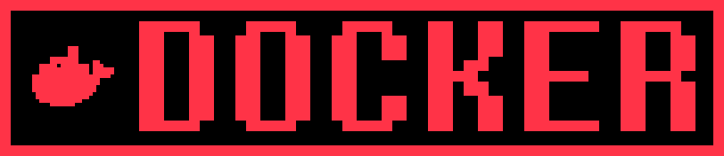&nbsp;
  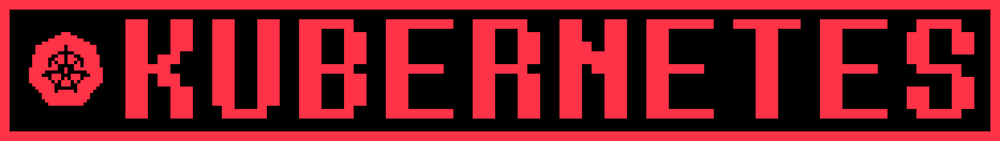&nbsp;
  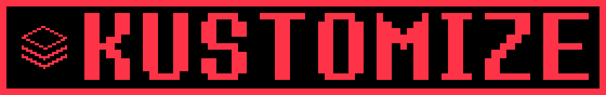&nbsp;
  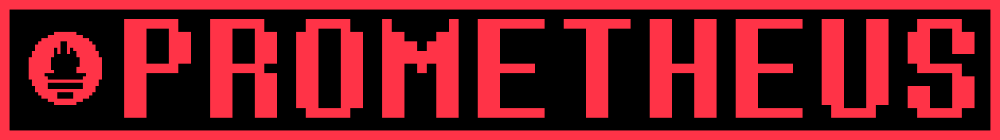&nbsp;
  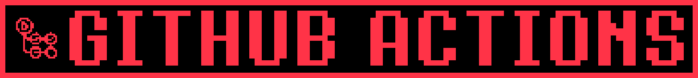&nbsp;
  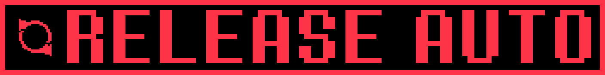&nbsp;
  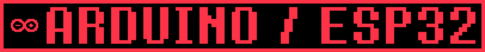&nbsp;
  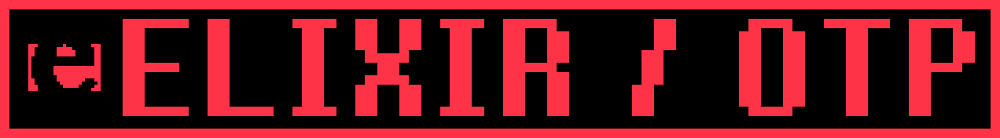
</p>
</details>

<details>
<summary><strong>Quality</strong></summary>
<br />
<p>
  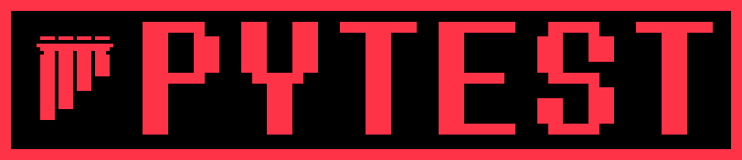&nbsp;
  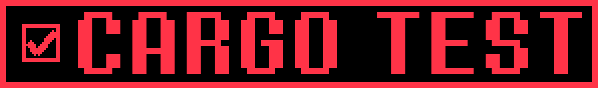&nbsp;
  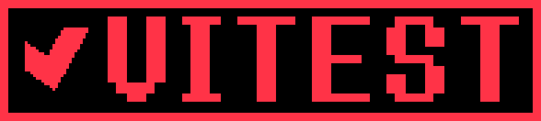&nbsp;
  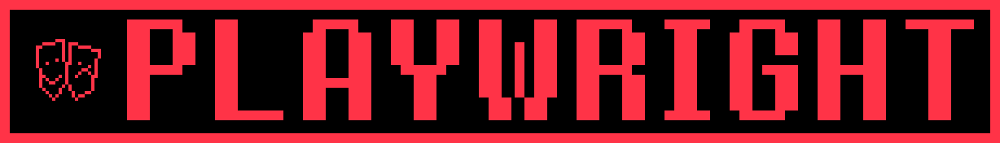&nbsp;
  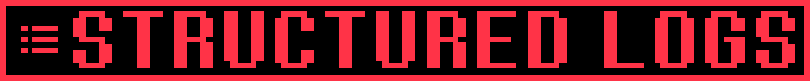&nbsp;
  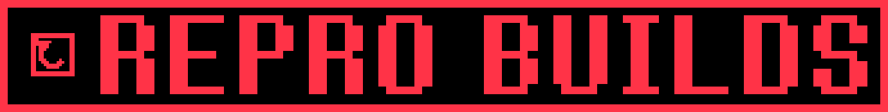
</p>
</details>

---

## Open Source

- **Active contributor** to [Emanuele-web04/synara](https://github.com/Emanuele-web04/synara/pulls?q=is%3Apr+author%3Acmdr-chara)
- **unitaryHACK bounty** for [Quantinuum/guppylang #1801](https://github.com/Quantinuum/guppylang/pull/1801)
- **Merged fixes** in [TestSprite CLI #118](https://github.com/TestSprite/testsprite-cli/pull/118) and [OpenCode #8240](https://github.com/anomalyco/opencode/pull/8240)
- **In review** in [Fileverse dDocs #557](https://github.com/fileverse/fileverse-ddocs/pull/557) and [UndertaleModTool #2398](https://github.com/UnderminersTeam/UndertaleModTool/pull/2398)

---

## Selected Projects

<table>
  <tr>
    <td width="50%" valign="top">
      <a href="https://github.com/cmdr-chara/deltamod"><strong>Deltamod Community</strong></a><br /><br />
      Community mod manager for DELTARUNE, UNDERTALE, and other GameMaker games. Supports local imports, multiple profiles, and checksum-verified Tauri v2 releases.<br /><br />
      <code>Rust</code> <code>Tauri v2</code> <code>TypeScript</code>
    </td>
    <td width="50%" valign="top">
      <a href="https://github.com/cmdr-chara/codex-toolkit"><strong>Codex Toolkit</strong></a><br /><br />
      Fifteen installable Codex skills and six optional agents for real software projects. Includes offline structural validation and network-free smoke tests.<br /><br />
      <code>Python</code> <code>agents</code> <code>validation</code>
    </td>
  </tr>
  <tr>
    <td width="50%" valign="top">
      <a href="https://github.com/cmdr-chara/open-job-scout"><strong>OpenJobScout</strong></a><br /><br />
      Privacy-first job discovery, verification, ranking, and tracking with transparent scoring and local SQLite storage. No hosted account or automatic applications.<br /><br />
      <code>Rust</code> <code>Python</code> <code>SQLite</code>
    </td>
    <td width="50%" valign="top">
      <a href="https://github.com/cmdr-chara/localeguard"><strong>LocaleGuard</strong></a><br /><br />
      Browser-only JSON localization QA for structural drift, placeholders, markup, escapes, and GameMaker control markers. Files never leave the browser.<br /><br />
      <code>TypeScript</code> <code>React</code> <code>Vitest</code>
    </td>
  </tr>
</table>

<details>
<summary><strong>More projects</strong></summary>
<br />

- [UTDR SoupGen Enhanced](https://github.com/cmdr-chara/UTDR-SoupGen): GameMaker textbox tooling with safer imports, recovery, GIF export, and Windows builds.
- [LeaveFlow](https://github.com/cmdr-chara/LeaveFlow): Django, Vue, PostgreSQL, Redis Streams, Elixir/OTP, Docker, and Kubernetes.
- [PulseDock](https://github.com/cmdr-chara/PulseDock): concurrent Go service monitor with Prometheus metrics and structured logs.
- [Smart Building Controller](https://github.com/cmdr-chara/smart-building-controller): Flutter, PHP, Arduino, and ESP32 building automation.
- [Deltarune Italian Pack](https://github.com/cmdr-chara/DeltaruneItalianPack): maintained localization pack with reproducible release automation.

</details>

---

## GitHub Stats

<p align="center">
  
  
</p>

<details>
<summary><strong>Contribution snake</strong></summary>
<br />

  <picture>
    <source media="(prefers-color-scheme: dark)" srcset="https://raw.githubusercontent.com/cmdr-chara/cmdr-chara/output/github-contribution-grid-snake-dark.svg" />
    <source media="(prefers-color-scheme: light)" srcset="https://raw.githubusercontent.com/cmdr-chara/cmdr-chara/output/github-contribution-grid-snake.svg" />
    
  </picture>

</details>

<details>
<summary><strong>Outside code</strong></summary>
<br />

Game aesthetics, localization, worldbuilding, and Fractured Hope.

Facing Demons Chara sprite by Jude. Textbox rendered with [Demirramon's generator](https://www.demirramon.com/generators/undertale_text_box_generator).

</details>

---

<p align="center">Issues and pull requests are welcome.</p>

```text
* you feel a strange presence.
* it fills you with determination.
```
