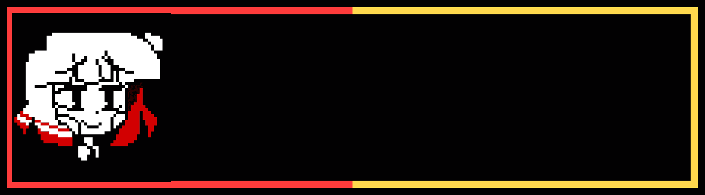

<div align="center">
  
</div>

<p align="center">
  <a href="#check"></a>
  <a href="#quest-log"></a>
  <a href="#inventory"></a>
  <a href="https://www.wattpad.com/myworks/389549996-fractured-hope"></a>
</p>

<div align="center">
  
</div>

<p align="center">
  <sub>Original Chara R&amp;Y portrait by Alatorll · textbox rendered with <a href="https://www.demirramon.com/generators/undertale_text_box_generator">Demirramon's generator</a></sub>
</p>

---

```text
SAVE FILE // 01

alias  : cmdr-chara
class  : backend developer / OSS contributor / writer
builds : APIs / automation / developer tools / data pipelines
stack  : Go / Python / TypeScript / Django / Docker
status : shipping, learning, contributing upstream
route  : useful things without linkedin energy
```

## CHECK

I build **backend systems**, **automation workflows**, and developer tools that turn vague requirements into tested, documented software. My work spans **Go**, **Python**, **Django REST Framework**, **TypeScript**, **Docker**, CI/CD, and AI-data pipelines.

I also contribute to codebases I do not own. That means reading unfamiliar systems, responding to review, passing CI, and leaving the project better than I found it.

> Outside the terminal: game aesthetics, localization, worldbuilding, and **Fractured Hope**. The darker vibe is staying.

## QUEST LOG

| Status | Upstream contribution | What changed |
| :---: | --- | --- |
| `MERGED` | [`TestSprite/testsprite-cli` #118](https://github.com/TestSprite/testsprite-cli/pull/118) | Preserved buffered input across sequential CLI prompts and added regression coverage for piped input, EOF, CRLF, and secret prompts. |
| `BOUNTY` | [unitaryHACK 2026 · `Quantinuum/guppylang` #1801](https://unitaryhack.dev/projects/guppy-hugr-tket/) | Won the USD 100 Guppy/HUGR/TKET bounty by integrating `scipy.optimize.minimize` into the QAOA MaxCut example; the [PR](https://github.com/Quantinuum/guppylang/pull/1801) passed review and 11 automated checks. |
| `MERGED` | [`anomalyco/opencode` #8240](https://github.com/anomalyco/opencode/pull/8240) | Added Undertale and Deltarune themes to an open-source AI coding agent. |

## INVENTORY

<p>
  
  
  
  
  
  
  
  
  
</p>

```text
equipped : REST APIs / SQL / JSONL / SFT-RAG / testing / CI-CD
learning : cloud-native systems / distributed services / deeper Go
passive  : curiosity + stubborn debugging + documentation instinct
```

## SAVE POINTS

| Project | Build | Proof |
| --- | --- | --- |
| [**PulseDock**](https://github.com/cmdr-chara/PulseDock) | Concurrent service monitor in Go with live metrics and a bilingual dashboard. | Go · concurrency · observability · API/UI |
| [**LeaveFlow**](https://github.com/cmdr-chara/LeaveFlow) | Full-stack leave-management system with roles, workflows, logging, tests, and CI. | Django REST · Vue · PostgreSQL · Docker |
| [**Codex Toolkit**](https://github.com/cmdr-chara/codex-toolkit) | Reusable Codex skills, model-routed agents, and cross-platform installers. | Python · agents · automation · tooling |
| [**Smart Building Controller**](https://github.com/cmdr-chara/smart-building-controller) | Documented hardware/software system connecting a Flutter app to PHP and ESP32/Arduino services. | Flutter · Dart · PHP · C++ · IoT |
| [**Deltarune Italian Pack**](https://github.com/cmdr-chara/DeltaruneItalianPack) | Italian localization package with an automated release workflow. | localization · packaging · GitHub Actions |

<details>
<summary><b>OPEN SECRET FILE</b></summary>

```text
- you opened it.
- nice.

currently:
- building systems
- contributing upstream
- documenting the weird parts
- learning by shipping
- writing stories when the code behaves

that's basically it.
```

</details>

---

<p align="center">
  <a href="https://www.wattpad.com/myworks/389549996-fractured-hope"></a>
  
</p>

```text
* you feel a strange presence.
* it fills you with determination.
```
