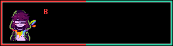

<div align="center">
  

  <p>
    <strong>cmdr-chara</strong><br />
    backend · platform · developer tooling · Italy / CET
  </p>

  <p>
    <a href="#current-save">current work</a> ·
    <a href="#save-points">projects</a> ·
    <a href="#quest-log">open source</a> ·
    <a href="#inventory">stack</a>
  </p>
</div>

<p align="center">
  <sub>Facing Demons Chara sprite by Jude · textbox rendered with <a href="https://www.demirramon.com/generators/undertale_text_box_generator">Demirramon's generator</a></sub>
</p>

---

## CHECK

I'm a junior software developer with **3+ years of hands-on project work** across backend services, desktop applications, developer tooling, and local-first utilities. Most of my current work uses **Rust, TypeScript, Python, and Go**.

I care about the parts around the feature too: tests that catch real regressions, CI that proves the build, release artifacts that can be verified, and documentation that explains the awkward parts.

> Based in Italy, EU citizen, and open to remote junior roles in backend, platform engineering, and developer tooling.

## CURRENT SAVE

- Preparing the stable [**Deltamod Community 2.0.3**](https://github.com/cmdr-chara/deltamod) release after its public beta line: Tauri v2 packaging, cross-platform patch tooling, checksums, dependency verification, and Sigstore artifact attestations.
- Evolving [**UTDR SoupGen Enhanced**](https://github.com/cmdr-chara/UTDR-SoupGen/releases/tag/v1.6.9) from its storage, ZIP-import, GIF-export, and build hardening into a quieter [**Calm UI redesign**](https://github.com/cmdr-chara/UTDR-SoupGen/tree/calm-ui-redesign).
- Contributing an [**Ultra Dark theme**](https://github.com/fileverse/fileverse-ddocs/pull/557) to Fileverse dDocs and a [**sound-export throughput improvement**](https://github.com/UnderminersTeam/UndertaleModTool/pull/2398) to UndertaleModTool; both are currently in review.

## SAVE POINTS

<table>
  <tr>
    <td width="50%" valign="top">
      <a href="https://github.com/cmdr-chara/deltamod"><strong>Deltamod Community</strong></a><br />
      <sub>community-maintained fork</sub><br /><br />
      Cross-platform GameMaker mod manager moving from Electron to Tauri v2, with transactional patching, verified native tools, automated tests, release checksums, and provenance attestations.<br /><br />
      <code>Rust</code> <code>Tauri v2</code> <code>TypeScript</code> <code>Vitest</code> <code>Playwright</code>
    </td>
    <td width="50%" valign="top">
      <a href="https://github.com/cmdr-chara/codex-toolkit"><strong>Codex Toolkit</strong></a> · <a href="https://github.com/cmdr-chara/codex-toolkit/releases/tag/v0.4.0">v0.4.0</a><br />
      <sub>original project</sub><br /><br />
      Fifteen installable Codex skills, six optional agents, cross-platform setup helpers, offline validation, and smoke tests for real repository work.<br /><br />
      <code>Python</code> <code>agents</code> <code>automation</code> <code>validation</code> <code>tooling</code>
    </td>
  </tr>
  <tr>
    <td width="50%" valign="top">
      <a href="https://github.com/cmdr-chara/open-job-scout"><strong>OpenJobScout</strong></a> · <a href="https://github.com/cmdr-chara/open-job-scout/releases/tag/v0.1.0">v0.1.0</a><br />
      <sub>original project</sub><br /><br />
      Local-first CLI for discovering, verifying, ranking, and tracking jobs. Its scoring stays inspectable and application data remains in SQLite on the user's machine.<br /><br />
      <code>Python</code> <code>SQLite</code> <code>CLI</code> <code>pytest</code> <code>CI</code>
    </td>
    <td width="50%" valign="top">
      <a href="https://cmdr-chara.github.io/localeguard/"><strong>LocaleGuard</strong></a> · <a href="https://github.com/cmdr-chara/localeguard">source</a><br />
      <sub>original project · live demo</sub><br /><br />
      In-browser JSON localization preflight for broken placeholders, markup, escapes, structure, and GameMaker control markers. Files never leave the browser.<br /><br />
      <code>TypeScript</code> <code>React</code> <code>Vite</code> <code>Vitest</code> <code>GitHub Pages</code>
    </td>
  </tr>
</table>

<details>
<summary><strong>More systems work</strong></summary>

- [**UTDR SoupGen Enhanced**](https://github.com/cmdr-chara/UTDR-SoupGen): maintained GameMaker fork with journaled recovery, defensive ZIP preflight, transactional imports, bounded GIF export, static validation, and automated Windows builds.
- [**LeaveFlow**](https://github.com/cmdr-chara/LeaveFlow): role-aware leave workflows, Django REST, Vue, PostgreSQL, Redis Streams, an Elixir/OTP worker, authenticated SSE, Docker, and Kubernetes/Kustomize.
- [**PulseDock**](https://github.com/cmdr-chara/PulseDock): concurrent Go service monitor with bounded workers, connection reuse, structured logs, Prometheus metrics, rolling uptime and p95 reporting, and graceful shutdown.
- [**UTDR Dataset Toolkit**](https://huggingface.co/datasets/cmdr-chara/utdr-dataset-toolkit): public documentation and synthetic samples for a private SFT/RAG data pipeline, including provenance boundaries, split-leakage controls, and sealed evaluation cases.
- [**Deltarune Italian Pack**](https://github.com/cmdr-chara/DeltaruneItalianPack): maintained Italian localization pack with release automation and reproducible distribution workflows.
- [**Smart Building Controller**](https://github.com/cmdr-chara/smart-building-controller): awarded school project connecting a Flutter app to PHP and ESP32/Arduino services for building automation.

</details>

## QUEST LOG

**15 merged upstream pull requests across four public projects**, plus current contributions in review.

| Status | Upstream contribution | Result |
| :---: | --- | --- |
| `12 MERGED` | [`Emanuele-web04/synara`](https://github.com/Emanuele-web04/synara/pulls?q=is%3Apr+author%3Acmdr-chara+is%3Amerged) | Improved Windows PTY startup, updater and provider recovery, live tool activity, queue semantics, thread-state handling, and regression coverage across twelve upstream PRs. |
| `BOUNTY` | [unitaryHACK 2026 · `Quantinuum/guppylang` #1801](https://github.com/Quantinuum/guppylang/pull/1801) | Integrated `scipy.optimize.minimize` into the QAOA MaxCut example, passed review and 11 automated checks, and earned the Guppy/HUGR/TKET bounty. |
| `MERGED` | [`TestSprite/testsprite-cli` #118](https://github.com/TestSprite/testsprite-cli/pull/118) | Preserved buffered input across sequential CLI prompts and added regression coverage for piped input, EOF, CRLF, and secret prompts. |
| `MERGED` | [`anomalyco/opencode` #8240](https://github.com/anomalyco/opencode/pull/8240) | Added Undertale and Deltarune themes to the open-source coding agent. |
| `IN REVIEW` | [`fileverse/fileverse-ddocs` #557](https://github.com/fileverse/fileverse-ddocs/pull/557) | Adds an Ultra Dark theme across the editor surface, preferences, theme metadata, and focused tests. |
| `IN REVIEW` | [`UnderminersTeam/UndertaleModTool` #2398](https://github.com/UnderminersTeam/UndertaleModTool/pull/2398) | Reduces sound-export overhead through bounded parallel work and reusable conversion state. |

## INVENTORY

| Area | Tools I use |
| --- | --- |
| Languages | `Rust` · `TypeScript` · `Python` · `Go` · `SQL` · `GameMaker Language` · `Dart` |
| Backend and data | `REST APIs` · `Django REST` · `Node.js` · `PostgreSQL` · `SQLite` · `Redis Streams` |
| Desktop and web | `Tauri v2` · `Electron` · `GameMaker` · `React` · `Vue 3` · `Flutter` · `Vite` |
| Platform | `Docker` · `Kubernetes` · `Kustomize` · `Prometheus` · `GitHub Actions` · release automation |
| Quality | `pytest` · `cargo test` · `Vitest` · `Playwright` · structured logging · reproducible builds |

<details>
<summary><strong>OPEN SECRET FILE</strong></summary>

```text
- you opened it.
- nice.

outside the terminal:
- game aesthetics
- localization
- worldbuilding
- Fractured Hope
```

</details>

---

<p align="center">
  Found something useful? Issues and pull requests are welcome.<br />
  <sub>A star helps me see which projects people want me to keep improving.</sub>
</p>

```text
* you feel a strange presence.
* it fills you with determination.
```
