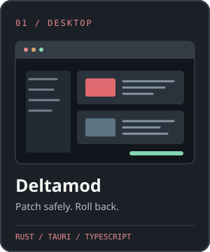
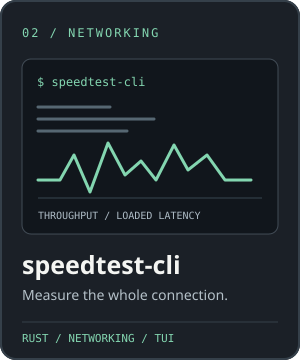
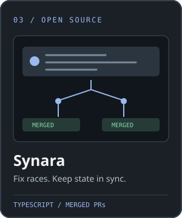

  <picture>
    <source media="(prefers-color-scheme: dark)" srcset="assets/cmdr-chara-logo-dark.svg" />
    
  </picture>

  

<code>Rust</code> · <code>TypeScript</code> · <code>Flutter</code> · <code>Python</code> · <code>C#</code>

  
  
  

  <a href="https://github.com/cmdr-chara/deltamod#see-it-in-action">Deltamod demo</a> ·
  <a href="https://github.com/cmdr-chara/speedtest-cli#see-it-in-action">speedtest-cli demo</a> ·
  <a href="https://github.com/Emanuele-web04/synara/pulls?q=is%3Apr+author%3Acmdr-chara+is%3Amerged">Synara PRs</a>

<a href="https://github.com/cmdr-chara/deltamod#about-this-community-fork">Deltamod fork & attribution</a> · <a href="https://github.com/cmdr-chara/speedtest-cli/blob/determination/LICENSE">speedtest-cli license</a>

---

**More projects:** [OpenJobScout](https://github.com/cmdr-chara/open-job-scout) · [LeaveFlow](https://github.com/cmdr-chara/LeaveFlow) · [Smart Building Controller](https://github.com/cmdr-chara/smart-building-controller)

**More merged fixes:** [Zed](https://github.com/zed-industries/zed/pull/63766) · [TestSprite CLI](https://github.com/TestSprite/testsprite-cli/pull/118) · [all merged PRs](https://github.com/search?q=is%3Apr+is%3Amerged+author%3Acmdr-chara+-user%3Acmdr-chara&type=pullrequests)

I reproduce, make focused changes, and verify them with relevant tests. I review the final code and claims myself, including when I use coding agents.
