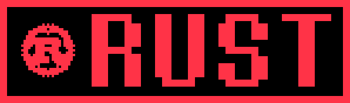
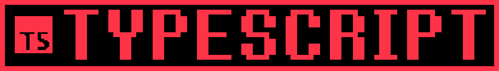
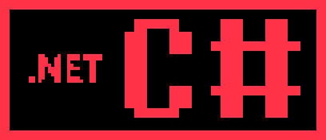
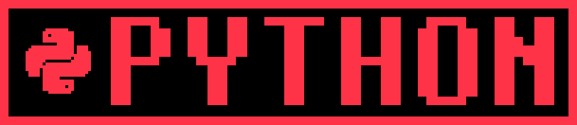
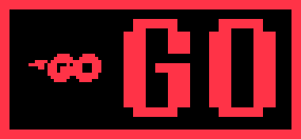

<div align="center">
  

  <h1>Full-Stack &amp; Platform Developer</h1>

  <p>Building cross-platform applications, developer tooling, local-first software, and reliable release systems.</p>
  <p>Italy · Open to remote roles</p>

  <p>
    <a href="#featured-work">Featured Work</a> ·
    <a href="#open-source">Open Source</a> ·
    <a href="#current-work">Current Work</a> ·
    <a href="#capabilities">Capabilities</a> ·
    <a href="#more-work">More Work</a>
  </p>
</div>

---

## Featured work

<table>
  <tr>
    <td width="50%" valign="top">
      <a href="https://github.com/cmdr-chara/deltamod">
        
      </a>
      <br /><br />
      <a href="https://github.com/cmdr-chara/deltamod"><strong>Deltamod Community</strong></a><br />
      Community-built mod manager for DELTARUNE, UNDERTALE, and other GameMaker games, with local imports, multiple installations and profiles, cross-platform releases, and checksum verification.
      <br /><br />
      <code>Rust</code> <code>Tauri v2</code> <code>TypeScript</code> <code>Release Engineering</code>
    </td>
    <td width="50%" valign="top">
      <a href="https://github.com/cmdr-chara/UndertaleModTool/tree/winui-preview">
        
      </a>
      <br /><br />
      <a href="https://github.com/cmdr-chara/UndertaleModTool/tree/winui-preview"><strong>UndertaleModTool — WinUI 3 Preview</strong></a><br />
      Windows-native modernization fork of UndertaleModTool with redesigned resource browsing, richer sprite and texture inspection, embedded audio playback, preview caching, and a WinUI 3 shell over the established GameMaker tooling stack.
      <br /><br />
      <code>C#</code> <code>.NET</code> <code>WinUI 3</code> <code>Windows App SDK</code>
    </td>
  </tr>
</table>

<table>
  <tr>
    <td width="44%" valign="middle">
      <a href="https://github.com/Emanuele-web04/synara">
        
      </a>
    </td>
    <td width="56%" valign="middle">
      <a href="https://github.com/Emanuele-web04/synara"><strong>Synara — Upstream Contributor</strong></a><br /><br />
      Active contributor to a local-first desktop workspace for coding agents. Merged work includes a first-class DeepSeek Harness provider, streaming correctness fixes, credential-redaction hardening, and a server-status CLI surface.
      <br /><br />
      <code>TypeScript</code> <code>ACP</code> <code>Provider Integration</code> <code>Reliability</code>
      <br /><br />
      <a href="https://github.com/Emanuele-web04/synara/pulls?q=is%3Apr+author%3Acmdr-chara">View upstream pull requests →</a>
    </td>
  </tr>
</table>

## Current work

| Status | Project | What I am working on |
| --- | --- | --- |
| Active | [Codex Toolkit](https://github.com/cmdr-chara/codex-toolkit) · [OpenJobScout](https://github.com/cmdr-chara/open-job-scout) | Workflow tooling and a local-first Python/Rust job tracker with SQLite, native ATS sources, optional Firecrawl discovery, verification, ranking, and review flows. |
| Active | [Deltamod Community](https://github.com/cmdr-chara/deltamod) | Continuing the Tauri v2 migration of a cross-platform mod manager, with native hashing, archive validation, transactional patching, and release checks. |
| Maintained | [UTDR SoupGen Enhanced](https://github.com/cmdr-chara/UTDR-SoupGen/tree/codex/enhanced-soupgen) | Improving a GameMaker dialogue tool with safer ZIP imports, recovery, bounded GIF export, and reproducible Windows builds. |

---

## Open Source

- **Synara:** active contributor with **47 merged upstream PRs**, spanning provider integrations, reliability, CLI, diagnostics, and documentation. See the [merged contribution list](https://github.com/Emanuele-web04/synara/pulls?q=is%3Apr+author%3Acmdr-chara+is%3Amerged), including [DeepSeek Harness support #723](https://github.com/Emanuele-web04/synara/pull/723), [streamed assistant-text correctness #692](https://github.com/Emanuele-web04/synara/pull/692), [credential redaction #706](https://github.com/Emanuele-web04/synara/pull/706), and [server status CLI #704](https://github.com/Emanuele-web04/synara/pull/704).
- **Quantinuum / Guppy:** merged [unitaryHACK contribution #1801](https://github.com/Quantinuum/guppylang/pull/1801), replacing random QAOA parameter sampling with SciPy optimization in the example workflow.
- **TestSprite CLI:** merged [buffered prompt-input fix #118](https://github.com/TestSprite/testsprite-cli/pull/118), preserving queued answers correctly across sequential prompts and line-ending variants.

<details>
<summary><strong>More upstream work</strong></summary>
<br />

- [OpenCode #8240](https://github.com/anomalyco/opencode/pull/8240): merged Undertale and Deltarune built-in themes.
- Ongoing Synara work spans ACP/provider integrations, Windows and WSL execution, diagnostics, reliability, and architecture.

</details>

---

## Capabilities

<p align="center">
  &nbsp;&nbsp;
  &nbsp;&nbsp;
  &nbsp;&nbsp;
  &nbsp;&nbsp;
  
</p>

| Area | Tools and technologies |
| --- | --- |
| **Desktop & cross-platform** | Tauri v2, WinUI 3 / .NET, Electron, Flutter |
| **Web & backend** | TypeScript, React, Vue, Vite, Node.js, Django REST, PHP |
| **Data & platform** | SQLite, PostgreSQL, Redis Streams, Docker, Kubernetes, Prometheus, GitHub Actions |
| **Quality & delivery** | cargo test, pytest, Vitest, Playwright, structured logging, reproducible builds, release automation |

<details>
<summary><strong>Additional technologies</strong></summary>
<br />

C++, JavaScript, Elixir/OTP, PowerShell, SQL, Dart, GameMaker Language, Arduino and ESP32, Kustomize, and REST API design.

</details>

---

## More Work

<details>
<summary><strong>Projects and experiments</strong></summary>
<br />

- [LocaleGuard](https://github.com/cmdr-chara/localeguard) — browser-only JSON localization QA for structural drift, placeholders, markup, escapes, and GameMaker control markers.
- [Smart Building Controller](https://github.com/cmdr-chara/smart-building-controller) — Flutter app, authenticated PHP backend, ESP32 bridge, Arduino modules, and physical sensors/actuators.
- [Deltarune Italian Pack](https://github.com/cmdr-chara/DeltaruneItalianPack) — maintained localization pack with reproducible release automation.
- [PulseDock](https://github.com/cmdr-chara/PulseDock) — concurrent Go service monitor with Prometheus metrics and structured logs.
- [LeaveFlow](https://github.com/cmdr-chara/LeaveFlow) — Django, Vue, PostgreSQL, Redis Streams, Elixir/OTP, Docker, and Kubernetes.

</details>

---

## Activity

<p align="center">
  
</p>

<details>
<summary><strong>Contribution graph</strong></summary>
<br />

<picture>
  <source media="(prefers-color-scheme: dark)" srcset="https://raw.githubusercontent.com/cmdr-chara/cmdr-chara/output/github-contribution-grid-snake-dark.svg" />
  <source media="(prefers-color-scheme: light)" srcset="https://raw.githubusercontent.com/cmdr-chara/cmdr-chara/output/github-contribution-grid-snake.svg" />
  
</picture>

</details>

<details>
<summary><strong>Outside code</strong></summary>
<br />

Game aesthetics, localization, worldbuilding, and Fractured Hope.

Facing Demons Chara sprite by Jude. Textbox rendered with [Demirramon's generator](https://www.demirramon.com/generators/undertale_text_box_generator).

</details>

---

<p align="center">Issues and pull requests are welcome.</p>

```text
* you feel a strange presence.
* it fills you with determination.
```
